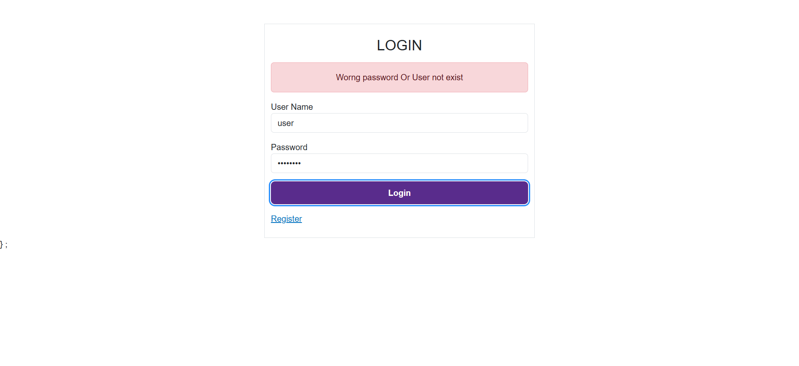
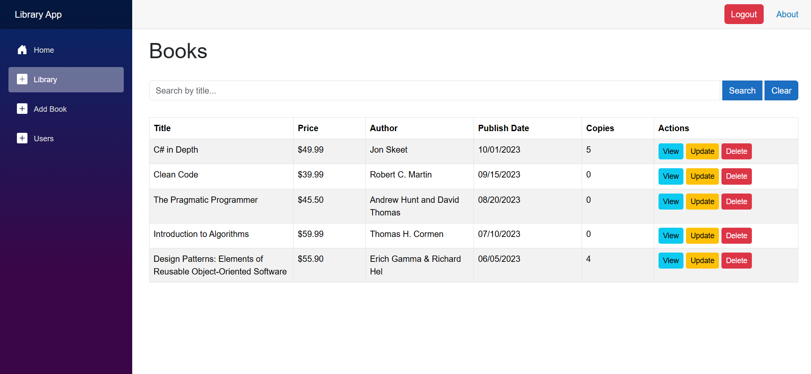
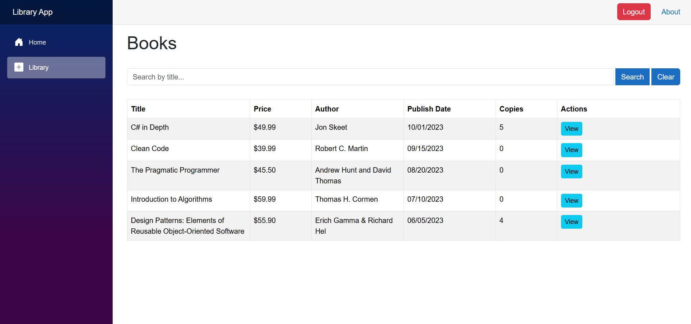
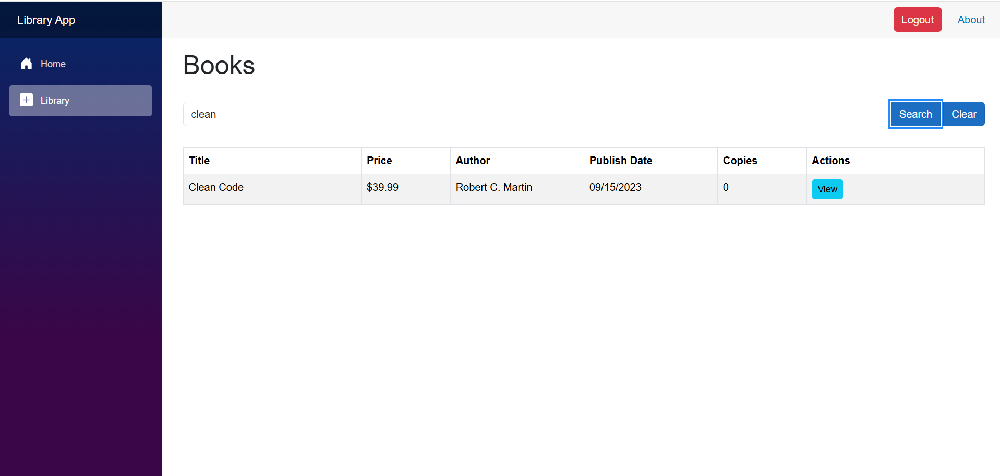

# 📚 Library Management App

A simple and intuitive **Library Management System** built to manage books, users, and administrative operations efficiently.

---

## 🚀 Features

### 👩‍💼 Admin
- Add, update, or delete books
- Manage users
- View all issued books and returns

### 👤 User
- Browse and search books
- Issue and return books
  

---

## 🔐 Authentication

Secure login system for both **Admin** and **User** roles.

---

## 🖼️ App Screenshots

### 🔐 Login Page

---

### 🏠 Admin Dashboard

---

### 🏠 User Home

---

### ➕ Search for Book

---

## 🛠️ Tech Stack

- **Frontend:** Blazor (WASM)
- **Backend:** ASP.NET Web API, EF, Automapper
- **Database:** SQL server 
- **Authentication:** JWT / Local Storage

